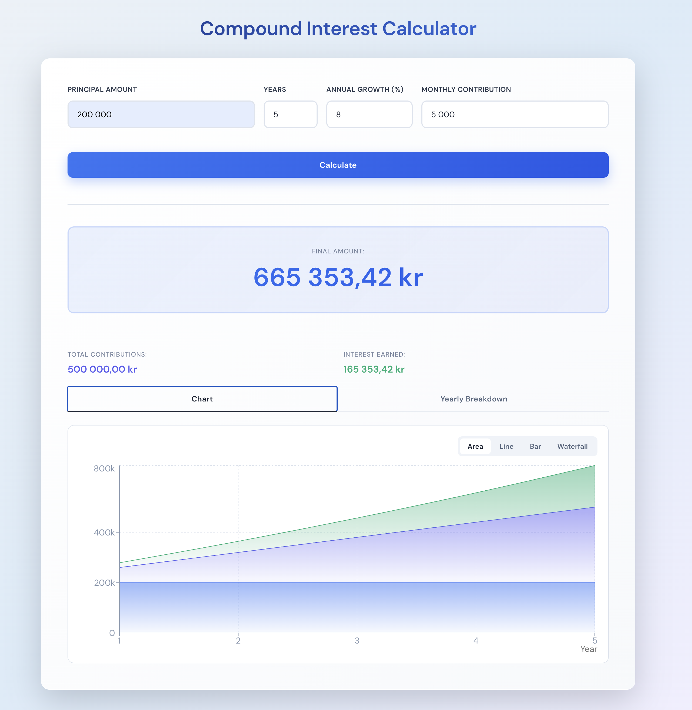
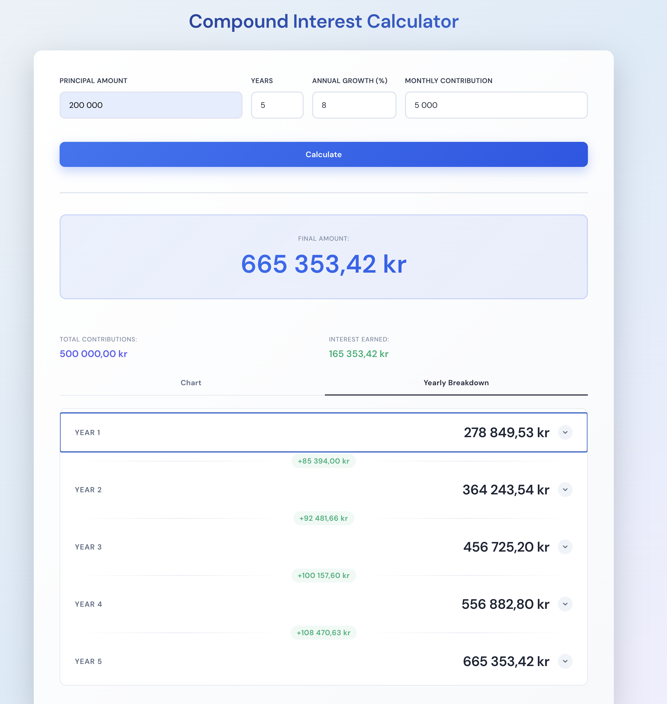
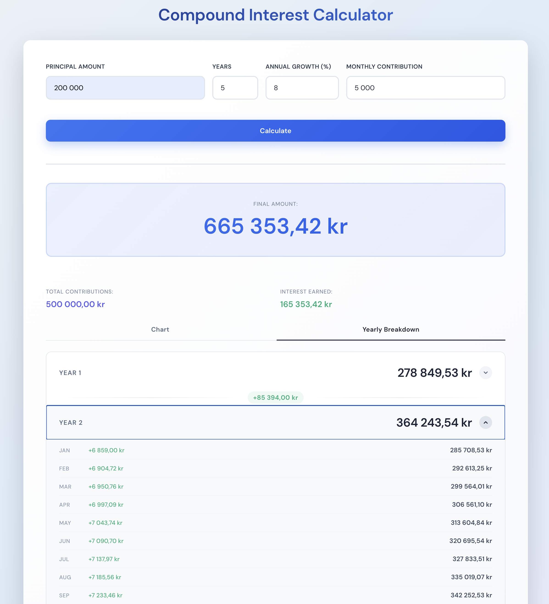

# Compound Interest Calculator

A React-based calculator that projects how an investment grows over time with monthly compounding and optional monthly contributions.

**Live demo**: [a-m-dev.github.io/compount-interest-calcualtor](https://a-m-dev.github.io/compount-interest-calcualtor/)

## Screenshots

### Chart view

Four chart types (Area, Line, Bar, Waterfall) visualize how principal, contributions, and interest stack up over the investment horizon.



### Yearly breakdown

End-of-year totals with year-over-year growth highlights between rows.



### Monthly breakdown

Each year row expands to reveal the month-by-month total and monthly growth within that year.



## Features

- **Inputs**: Initial principal, time horizon (years), annual growth rate, and optional monthly contribution
- **Final amount card**: Large, prominent display of the projected end value
- **Summary cards**: Total contributions and total interest earned
- **Tabbed visualization**: Switch between a chart view and a yearly breakdown list
- **Chart view with four chart types**:
  - *Area* — stacked area of principal, contributions, and interest
  - *Line* — multi-line view of the three components
  - *Bar* — cumulative stacked bars per year
  - *Waterfall* — year-by-year climb (prior balance → deposits → interest → new balance)
- **Yearly breakdown list**: End-of-year totals with year-over-year growth between rows; each year row expands into a month-by-month view

## How the Calculation Works

The app uses **monthly compounding** to mirror how most real-world investment accounts grow.

### Future Value of the Initial Principal

```
FV_principal = P × (1 + r/12)^(t × 12)
```

Where `P` is the principal, `r` is the annual rate (as a decimal), and `t` is the number of years.

### Future Value of Monthly Contributions (annuity formula)

```
FV_contributions = PMT × [((1 + r/12)^(t × 12) - 1) / (r/12)]
```

Where `PMT` is the monthly contribution amount. This accounts for each monthly payment earning interest over the months that remain after it is deposited.

### Final Amount

```
Final = FV_principal + FV_contributions
```

The yearly breakdown applies the same formulas with `t` set to each individual year (1, 2, 3, …) so the chart and list can show the growth curve.

## Project Structure

```
src/
├── main.tsx                          # React entry point
├── App.tsx                           # Top-level state and layout
├── App.css                           # Global styles (card, form, results grid)
├── index.css                         # Base styles
├── components/
│   ├── Form.tsx                      # Inputs and Calculate button
│   ├── FormField.tsx                 # Label + input wrapper
│   ├── NumberInput.tsx               # Input with thousands-separator formatting
│   ├── Results.tsx                   # Composes Final Amount, summary, and the tabs
│   ├── ResultsTabs.tsx               # Tab nav: Chart vs Yearly Breakdown
│   ├── ResultsTabs.css
│   ├── YearlyList.tsx                # Year rows with expandable month breakdown
│   ├── YearlyList.css
│   └── charts/
│       ├── Chart.tsx                 # Container with the chart-type toggle
│       ├── Chart.css
│       ├── AreaChartView.tsx         # Stacked area chart
│       ├── LineChartView.tsx         # Multi-line chart
│       ├── BarChartView.tsx          # Stacked bar chart (cumulative)
│       ├── WaterfallChartView.tsx    # Year-by-year waterfall bars
│       └── chartUtils.tsx            # Shared tooltip and axis helpers
└── utils/
    ├── calculations.ts               # Compound interest math + monthly/yearly breakdown
    └── formatting.ts                 # Swedish locale number/currency formatting
```

## Tech Stack

- **React 18** with **TypeScript**
- **Vite** for the dev server and build
- **Recharts** for the stacked area chart
- Plain CSS (no UI library) with component-scoped stylesheets for Chart and YearlyList

## Running Locally

```bash
npm install
npm run dev
```

The dev server runs at `http://localhost:5173`.

## Formatting Notes

Numbers are displayed using the Swedish locale (`sv-SE`), so thousands are separated by spaces and the decimal point is a comma. Currency values are suffixed with `kr`.
